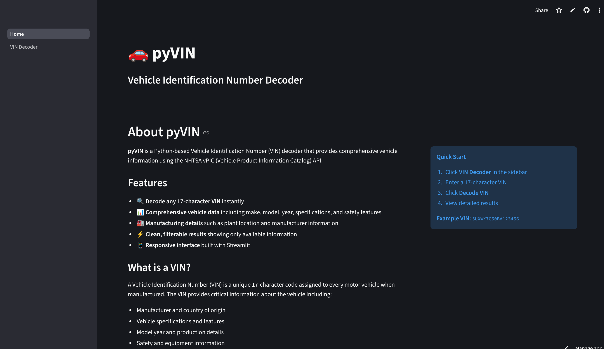
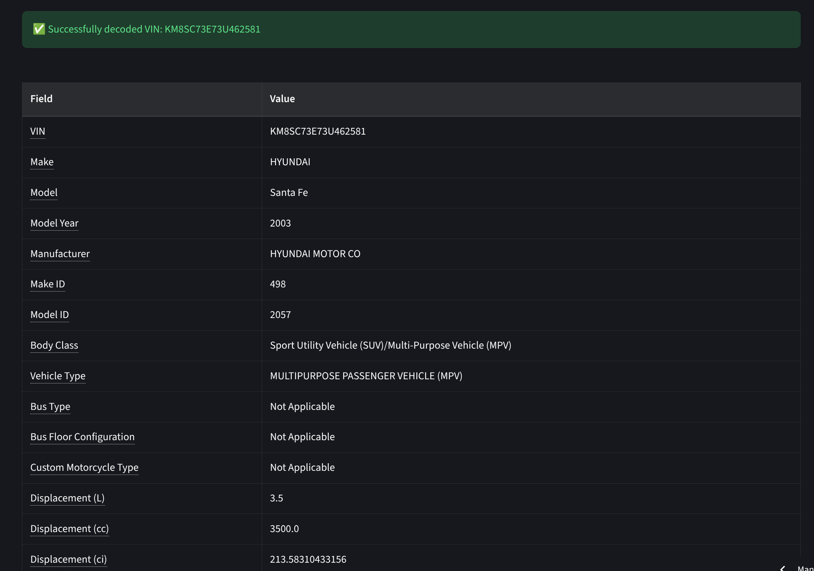
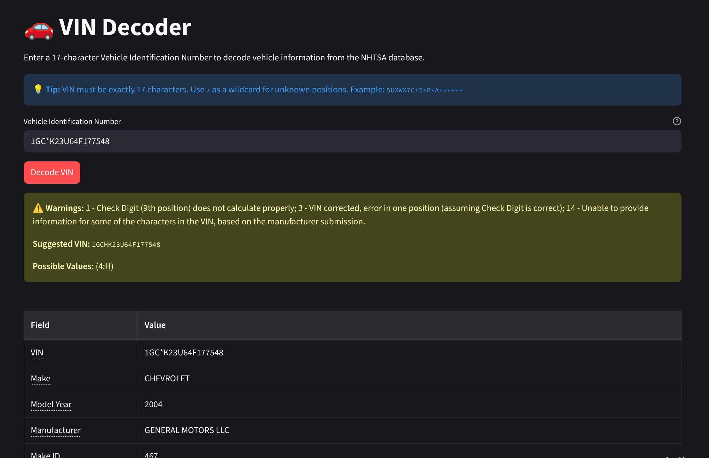

# pyVIN - Vehicle Identification Number Decoder

[](https://py-vin.streamlit.app/)
[](https://github.com/bmj2728/pyVIN/actions/workflows/ci.yml)
[](https://github.com/bmj2728/pyVIN/actions/workflows/docker.yml)
[](https://codecov.io/gh/bmj2728/pyVIN)
[](https://www.python.org/downloads/)
[](LICENSE)
[](https://github.com/pre-commit/pre-commit)

A Python-based Vehicle Identification Number (VIN) decoder that provides comprehensive vehicle information using the NHTSA vPIC (Vehicle Product Information Catalog) API.

## Table of Contents

- [Features](#features)
- [Gallery](#gallery)
- [Demo](#demo)
- [Installation](#installation)
- [Usage](#usage)
  - [Web Interface](#web-interface)
  - [Python API](#python-api)
- [Deployment](#deployment)
  - [Docker](#docker)
  - [PyPI](#pypi)
- [API Reference](#api-reference)
- [License](#license)
- [Acknowledgments](#acknowledgments)

## Features

- 🔍 **Decode 17-character VINs** - Full or partial VINs with wildcard support
- 📊 **Comprehensive Data** - Make, model, year, specifications, and safety features
- 🏭 **Manufacturing Details** - Plant location and manufacturer information
- ⚠️ **Smart Error Handling** - Distinguishes warnings from critical errors
- ✨ **Clean UI** - Responsive Streamlit interface with tooltips
- 🎯 **Filtered Results** - Shows only available data with clean field labels
- 🚀 **High Performance** - LRU caching for faster repeated queries
- 🧪 **Well Tested** - 97%+ code coverage with 100 passing tests

## Gallery

### Home Screen



### VIN Decoder


### Sample Results



### VIN Suggestions for Partial Matches



When using wildcards, pyVIN provides intelligent suggestions and shows possible values for unknown positions. For example:

- `1GC*K23U64F177548` → Suggests `1GCHK23U64F177548` with possible values `(4:H)`
- `1GC*K23*64F177548` → Less certain, shows `1GC!K23!64F177548` with multiple options `(4:ABCDEFGHJKLM)(8:12346789ABCDEGHNPRSTUVWXYZ)`

## Demo

**[Try it live!](https://py-vin.streamlit.app/)**

**Example VINs to try:**

- `5UXWX7C50BA123456` - Full VIN (BMW X3)
- `5UXWX7C*5*B*A******` - Partial VIN with wildcards
- `JHL**77813C002328` - Partial VIN (shows suggestions)

## Installation

### Prerequisites

- Python 3.10 or higher
- pip package manager

### Quick Install

```bash
# Clone the repository
git clone https://github.com/bmj2728/pyVIN.git
cd pyVIN

# Install
pip install .
```

## Usage

### Web Interface

Launch the Streamlit web application:

```bash
streamlit run src/ui/Home.py
```

The app will open in your browser at `http://localhost:8501`

**Navigation:**

- **Home** - Information about pyVIN and VIN basics
- **VIN Decoder** - Enter a VIN to decode vehicle information

**Tips:**

- VIN must be exactly 17 characters
- Use `*` as a wildcard for unknown positions
- Copy/paste VINs directly into the input field

### Python API

Use pyVIN programmatically in your Python code:

```python
from src.api.client import decode_vin_values_extended
from src.exceptions import VINDecoderError

try:
    # Decode a full VIN
    result = decode_vin_values_extended("5UXWX7C50BA123456")

    print(f"Make: {result.make}")
    print(f"Model: {result.model}")
    print(f"Year: {result.model_year}")
    print(f"Body: {result.body_class}")

    # Check for warnings
    if result.error_text and result.error_code != "0":
        print(f"Warning: {result.error_text}")
        if result.suggested_vin:
            print(f"Suggested VIN: {result.suggested_vin}")

except VINDecoderError as e:
    print(f"Error: {e}")
```

**Using wildcards for partial VINs:**

```python
# Partial VIN with wildcards
result = decode_vin_values_extended("5UXWX7C*5*B*A******")

# Filter to only populated fields
from src.formatting.response import filter_non_null
filtered_data = filter_non_null(result)

for field, value in filtered_data.items():
    print(f"{field}: {value}")
```

## Deployment

### Docker

**Using pre-built images from GitHub Container Registry:**

```bash
# Pull and run the latest version
docker run -p 8501:8501 ghcr.io/bmj2728/pyvin:latest

# Or use a specific version (e.g., 0.1.5)
docker run -p 8501:8501 ghcr.io/bmj2728/pyvin:<version>
```

**Docker Compose:**

```yaml
version: '3.8'
services:
  pyvin:
    image: ghcr.io/bmj2728/pyvin:latest
    ports:
      - "8501:8501"
    restart: unless-stopped
```

### PyPI

Available on PyPI for library use:

```bash
pip install pyVIN-UI
```

Then import in your code:

```python
from src.api.client import decode_vin_values_extended
```

Honestly though? Just clone the repo if you want to hack on it. It's MIT licensed - do whatever you want with it.

## API Reference

### Main Functions

#### `decode_vin_values_extended(vin: str) -> VINDecodeResult`

Decode a VIN using the NHTSA API.

**Parameters:**

- `vin` (str): 17-character VIN (use `*` for wildcards)

**Returns:**

- `VINDecodeResult`: Pydantic model with decoded data

**Raises:**

- `InvalidVINError`: Invalid VIN format
- `NetworkError`: Network/connection error
- `APIError`: Critical API error (400+ error codes)

**Example:**

```python
result = decode_vin_values_extended("5UXWX7C50BA123456")
print(result.make)  # "BMW"
```

#### `validate_and_normalize_vin(vin: str) -> str`

Validate and normalize a VIN string.

**Parameters:**

- `vin` (str): VIN to validate

**Returns:**

- `str`: Normalized VIN (uppercase, stripped)

**Raises:**

- `InvalidVINError`: Invalid VIN format

#### `filter_non_null(result: VINDecodeResult) -> Dict[str, Any]`

Filter out null/empty fields from a decode result.

**Parameters:**

- `result` (VINDecodeResult): Decode result to filter

**Returns:**

- `dict`: Dictionary with only populated fields

## License

This project is licensed under the MIT License - see the [LICENSE](LICENSE) file for details.

Copyright (c) 2025 NovelGit LLC

## Acknowledgments

- **NHTSA vPIC API** - Vehicle data provided by the National Highway Traffic Safety Administration
- **Streamlit** - Web framework for the user interface
- **Pydantic** - Data validation and settings management
- **Hypothesis** - Property-based testing framework

---

**Disclaimer:** This tool is for informational purposes only. Always verify vehicle information through official sources. NHTSA data may not be complete or fully accurate for all vehicles.

**Questions or Issues?** Open an issue on [GitHub](https://github.com/bmj2728/pyVIN/issues)
